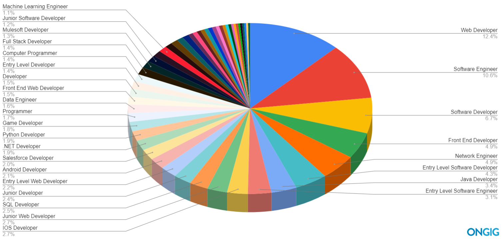
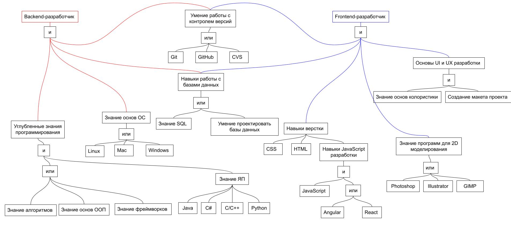
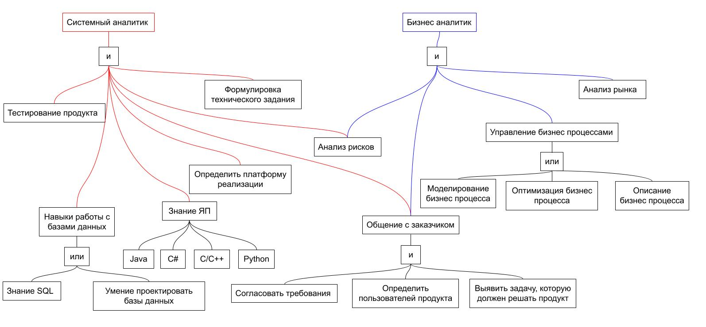
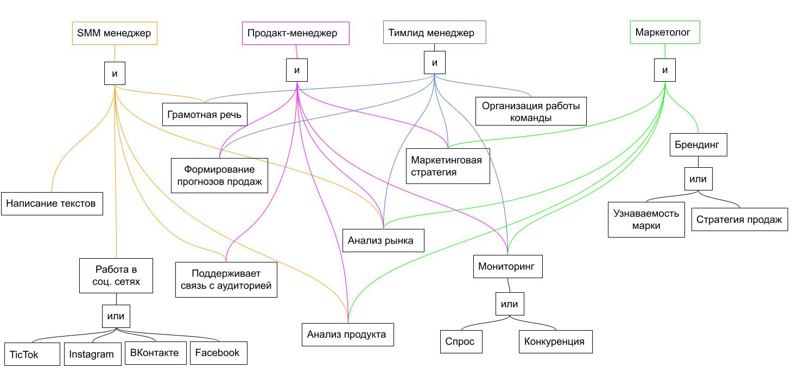
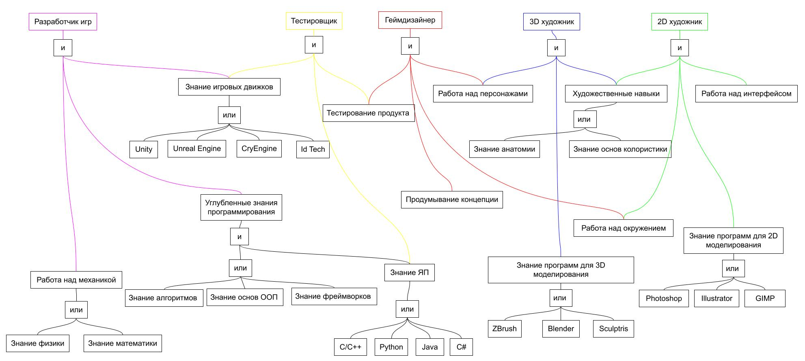
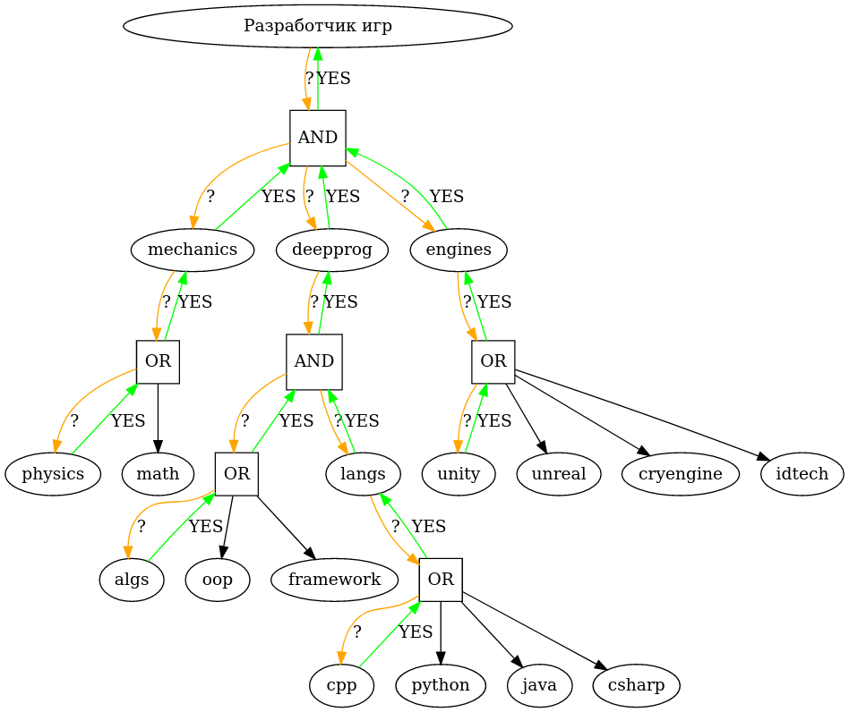
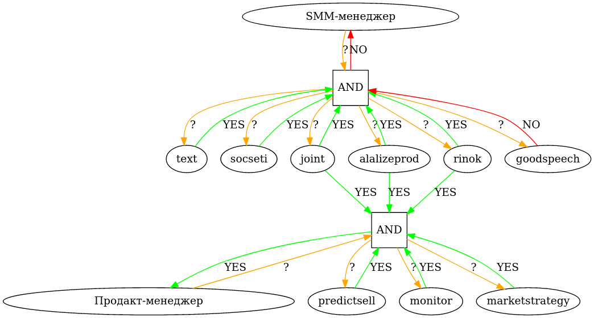

# Отчет по лабораторной работе
## по курсу "Искусственый интеллект"

### Студенты: 

| ФИО        | Роль в проекте                     | Оценка       |
|------------|------------------------------------|--------------|
| Блистунова | Разработка базы знаний | |
| Ефимов     | Реализация движка с помощью Prolog | |
| Живалёв    | Интеграция Prolog программы с ботом на Python | |
| Павлова    | Разработка базы знаний | |
| Туманов    | Преобразование базы знаний в правила и факты на Prolog | |

## Результат проверки

| Преподаватель     | Дата         |  Оценка       |
|-------------------|--------------|---------------|
| Сошников Д.В.     |              |     5          |

> *Хороший подробный отчет, реализация бота+ЭС на Прологе с общением через каналы.*

## Тема работы

Реализация простой экспертной системы, предлагающей пользователю подходящую 
ему работу в области IT на основе опроса его умений.

## Концептуализация предметной области

В области IT существует множество разных возможных работ, как и связанных 
между собою, так и совершенно независимых. Ниже как пример предоставлена 
круговая диаграмма, изображающая количество процентов запросов по 
должностям, специализирующимся на разработке.



Кроме разработки, существуют и другие подмножества, такие как 
руководство, администрирование (поддерживание каких-либо IT структур) и дизайн. 
Но в своих подмножествах, должности будут иметь одинаковые требования. Например, 
для frontend и backend разработчиков, одинаковым может быть требование 
знания JavaScript.

> Да и между областями могут быть одинаковыми требования, такие как опыт в 
> разработке как у разработчика, так и у руководителя (для понимания процесса).

Соответственно, чтобы не перебирать все возможные работы, должны быть выделены 
какие-то общие требования, невыполнение которых позволяет быстро отсекать 
связанные с ними должности.

Начальной идеей при структуризации этой области является выделение наиболее 
популярного набора должностей и последовательное определение требований 
каждой из них (см. папку [jobs](jobs/)), но она может быть улучшена в 
процессе разработки.

## Принцип реализации системы

Для данной лабораторной можно использовать как прямой, так и обратный вывод, 
но, в связи с древо-образной структурой, оптимальнее будет использовать 
обратный вывод, так как при нем будет проверяться наличие необходимых умений 
в рабочей памяти для текущей рассматриваемой должности, избегая опроса 
о ненужных на данный момент умениях. Такой вывод очень легко реализуется 
с помощью механизма логического вывода __Prolog__'а.

Сама программа разделена на четыре части, а именно: [база 
данных](expert/scheme.pl), [сам движок](expert/base.pl), 
[интерфейс](expert/ui.pl) (их взаимодействие будет описано в следующем 
пункте), а также сам [бот](bot/bot.py). 

Изначально предполагалось, что бот будет 
выполнять запросы к базе с помощью библиотеки __PySwip__, но из-за затруднений в 
разделении пользовательского ввода и логики программы, бот общается с 
программой как с отдельным процессом через каналы.

Сама программа имеет простой интерфейс, выводящий вопрос с соответствующим 
умением (задается разработчиком базы данных) и ожидающий ответ от 
пользователя. Вопросы задаются, пока не будет найдена подходящая работа и 
пока есть нерассмотренные вопросы. Бот пользуется этим интерфейсом при
отправке сообщений.

База знаний сформирована так, чтобы любой человек с умением работать в 
текстовом редакторе мог добавить свои знания. Например, умение работать над 
игровой механикой требует либо математики, либо физики. Это может быть 
описано как:

```prolog
trait(mechanics) :- 
    check(physics); % ; означает или
    check(math).
```

Про физику и математику мы решаем спросить пользователя напрямую. Тогда мы 
пишем:

```prolog
base_trait(physics, "Вы знаете физику?").
base_trait(math, "Вы знаете математику?").
```

Конечная цель - работа - задается предикатом _job/1_, причем в теле так же 
содержатся предикаты _check/1_:

```prolog
job("Кто-то"):-
    check(mechanics).
```

Так как выводится голова предиката, в ней должен быть доступный 
пользователю термин.

## Механизм вывода

Программа имеет очень простой механизм вывода путем унификации с предикатам 
_job/1_. В базе данных этот предикат будет иметь в правой части множество 
предикатов _check/1_ с вписанными в них необходимыми умениями. _check/1_ 
будет выполнять один из трех возможных действий:

1. Проверить наличие умения в рабочей памяти. Умение может отмечено как 
принятое (в случае чего предикат считается успешным) или отказанное (предикат 
считается неуспешным);
2. Попробовать вывести это умение с помощью trait/1;
3. Если есть факт _base\_trait/2_ с этим умением, то о нем можно спросить 
(вопрос содержится в этом же факте).

В первых двух случиях происходит отсечение, так как, если умение уже 
подтверждено, то оно уже определенное и перебор не нужен.

Следует заметить, что все умения должны быть определены в базе данных либо 
через _base\_trait/2_, либо через _trait/1_

## Извлечение знаний и база знаний

Над созданием базы знаний работало два человека.

Для начала все интересующие должности были выведены в единую таблицу, после 
чего были разделены на области, где они были схожи по смыслу и с большей 
вероятностью имели какие-то общие навыки. Полученные области: Игры, 
разработка, аналитика и продвижение. 

Далее, собиралась информация по этим должностям, а именно в чем они 
заключались и какие частые требования имели. При сборе использовались как 
статьи, описывающие эти должности, так и сами сайты поиска работ.

После того как информация была собрана и какие-то множества требований были определены, построены сами деревья:

#### Разработка


#### Аналитика


#### Продвижение


#### Игры


## Протокол работы системы

Пример вывода, когда на каждый вопрос дается ответ да:

```
Вы знаете физику? (Y/N):
|: y
Вы знаете основные алгоритмы? (Y/N):
|: y
Вы владеете языком программирования C/C++? (Y/N):
|: y
Вы умеете работать в Unity? (Y/N):
|: y
Подходящая работа: Разработчик игр
```

В базе знаний первой по очереди идет должность "Разработчика игр", поэтому 
система пытается первым делом вывести её. Использованная вырезка кода:

```prolog
base_trait(physics, "Вы знаете физику?").
base_trait(algs, "Вы знаете основные алгоритмы?").
base_trait(unity, "Вы умеете работать в Unity?").
base_trait(cpp, "Вы владеете языком программирования C/C++?").

trait(mechanics) :- 
	check(physics); check(math).

trait(deepprog) :- 
	(check(algs); check(oop); check(framework)), check(langs).

trait(langs) :-
	check(cpp); check(python); check(java); check(csharp).

trait(engines) :-
	check(unity); check(unreal); check(cryengine); check(idtech).

job("Разработчик игр") :-
	check(mechanics), check(deepprog), check(engines).
```

Дерево вывода в данном случае выглядет примерно так:




Пример использования системой рабочей памяти:

```
Вы знаете физику? (Y/N):
|: n
Вы знаете математику? (Y/N):
|: n
Вы умеете работать в Unity? (Y/N):
|: n
Вы умеете работать в Unreal Engine? (Y/N):
|: n
Вы умеете работать в Cry Engine? (Y/N):
|: n
Вы умеете работать в Id Tech? (Y/N):
|: n
Вы можете протестировать продукт? (Y/N):
|: n
Вы умеете работать над персонажами в играх? (Y/N):
|: n
Вы знаете анатомию? (Y/N):
|: n
Вы знаете основы колористики? (Y/N):
|: b
Вы знаете основные алгоритмы? (Y/N):
|: n
Вы знаете основы ООП? (Y/N):
|: n
Вы умеете работать с фреймворками? (Y/N):
|: n
Вы умеете пользоваться Git? (Y/N):
|: n
Вы умеете пользоваться GitHub? (Y/N):
|: n
Вы умеете пользоваться CVS? (Y/N):
|: n
Вы умеете анализировать риски? (Y/N):
|: n
Вы умеете писать тексты? (Y/N):
|: y
Вы работаете с соц.сетью ВКонтакте? (Y/N):
|: y
Вы поддерживаете связь с аудиторией? (Y/N):
|: y
Вы умеете анализировать продукт? (Y/N):
|: y
Вы умеете анализировать ситуацию на рынке? (Y/N):
|: y
У вас грамотная речь? (Y/N):
|: n
Вы умеете прогнозировать продажи? (Y/N):
|: y
Вы умеете мониторить спрос? (Y/N):
|: y
Вы знаете маркетинговые стратегии? (Y/N):
|: y
Подходящая работа: Продакт-менеджер
```

Для начала пропускаются должности "Разработчик игр", "Тестировщик", 
"Геймдизайнер", "3D художник", "2D художник", "Backend и Frontend 
разработчики", "Системный аналитик", и "Бизнес аналитик" чтобы 
дойти до этого кода:

```prolog
job("SMM менеджер") :-
	check(text), check(socseti), check(joint), check(alalizeprod), check(rinok), check(goodspeech).

job("Продакт-менеджер") :-
	check(predictsell), check(joint), check(alalizeprod), check(rinok), check(monitor), check(marketstrategy).
```

Здесь видно, что умения с термами _joint_, _alalizeprod_, _rinok_ совпадают, 
и, при ответе "Нет" на _goodspeech_, система спросит только про 
_predictsell_, _monitor_ и _marketstrategy_.

Вывод в виде дерева (начальные работы опущены):



## Выводы

Выводы по экспертной системе:

* Корректно исполненная экспертная система способна эмулировать работу 
эксперта, но для ее создание нужно найти эксперта, способного 
структуризировать свои знания, и наблюдать за его работой, параллельно 
заполняя базу знаний. В зависимости от сложности и размера области, на это 
можешь уходить неограниченно много времени (определение языков);
* Экспертная система работает только на статических знаниях и не 
предназначена для самообучения, что делает ее негибкой и требует наличие 
администратора, добавляющего новые знания и редактирующего известные, когда 
требуется;
* Существует множество инструментов, которые можно использовать в качестве 
движка экспертной системы. Наибольшей сложностью представляет разработка базы 
знаний.

Выводы по командной работе:

* Такой вывод уже не первый раз, но следует ввести отдельное обучение по 
работе с Git;
* Командная работа это, конечно, хорошо, но она добавляет лишний стресс если 
учитывать, что оценка других может зависеть от своей работы;
